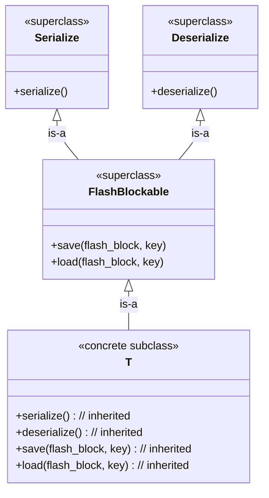

# Puzzle 10

We want a `FlashBlock` abstraction that can save and load many value types, but only when a value type supports both serialization and deserialization.

```mermaid
classDiagram
    direction TB

    class FlashBlockable {
        <<superclass>>
        +save(flash_block, key)
        +load(flash_block, key)
    }

    class Serialize {
        <<superclass>>
        +serialize()
    }

    class Deserialize {
        <<superclass>>
        +deserialize()
    }

    class T {
        <<concrete subclass>>
        +serialize() // inherited
        +deserialize() // inherited
        +save(flash_block, key) // inherited
        +load(flash_block, key) // inherited
    }

    Serialize <|-- FlashBlockable : is-a
    Deserialize <|-- FlashBlockable : is-a
    FlashBlockable <|-- T : is-a
```
