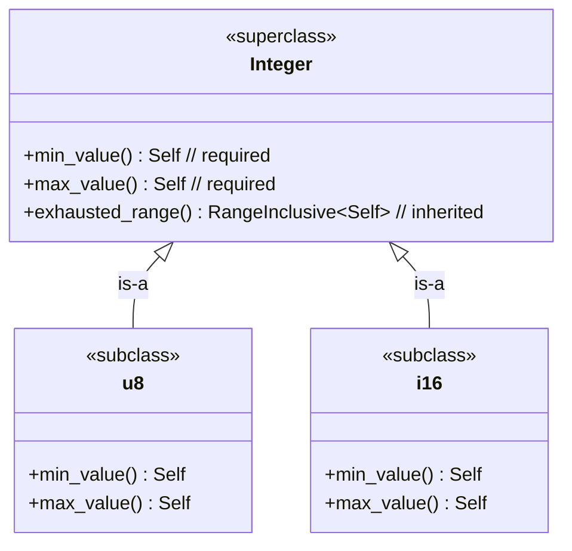

# Puzzle 1

In our library for sets of integers, we require that all integers have certain functions like `min_value`. We also want all integers to inherit certain other functions such as `exhausted_range`.

