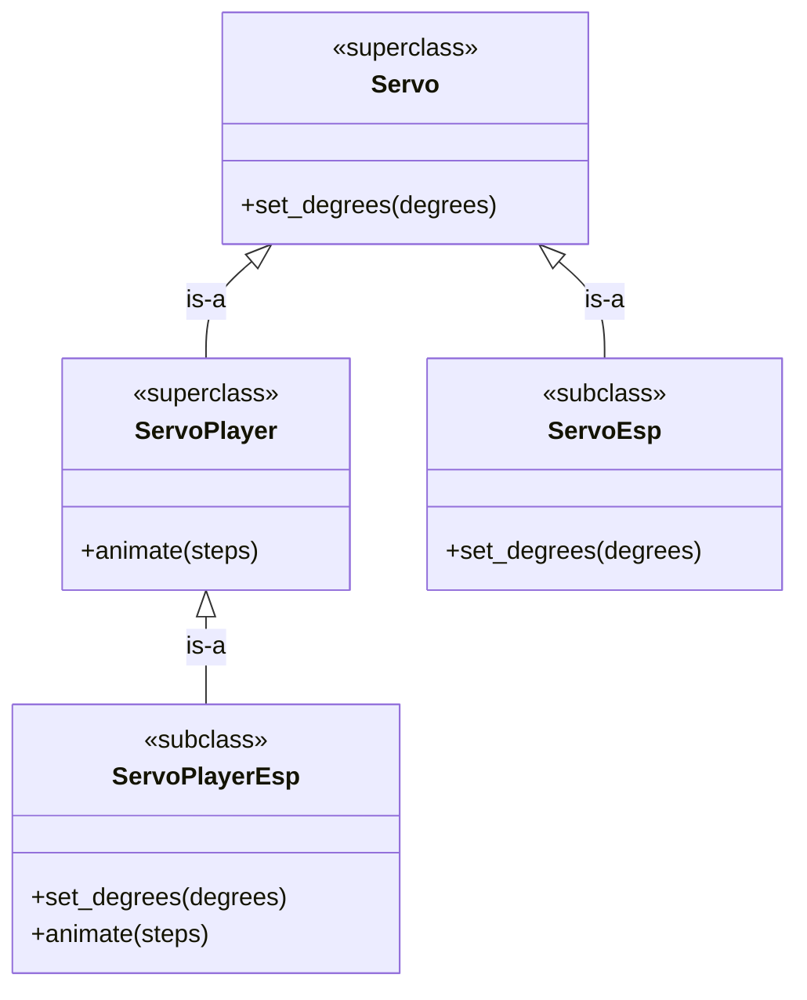

# Puzzle 2

In our library for microcontrollers, we have a `Servo` abstraction with required behavior like `set_degrees`. We then want a more specialized abstraction, `ServoPlayer`, that is a `Servo` and adds `animate`.

## Spec

1. Any `ServoPlayer` is-a `Servo`.
2. `Servo` requires `set_degrees`.
3. `ServoPlayer` requires `animate`.
4. `ServoEsp` should implement `Servo` only.
5. `ServoPlayerEsp` should implement `ServoPlayer` (and therefore also `Servo`).

