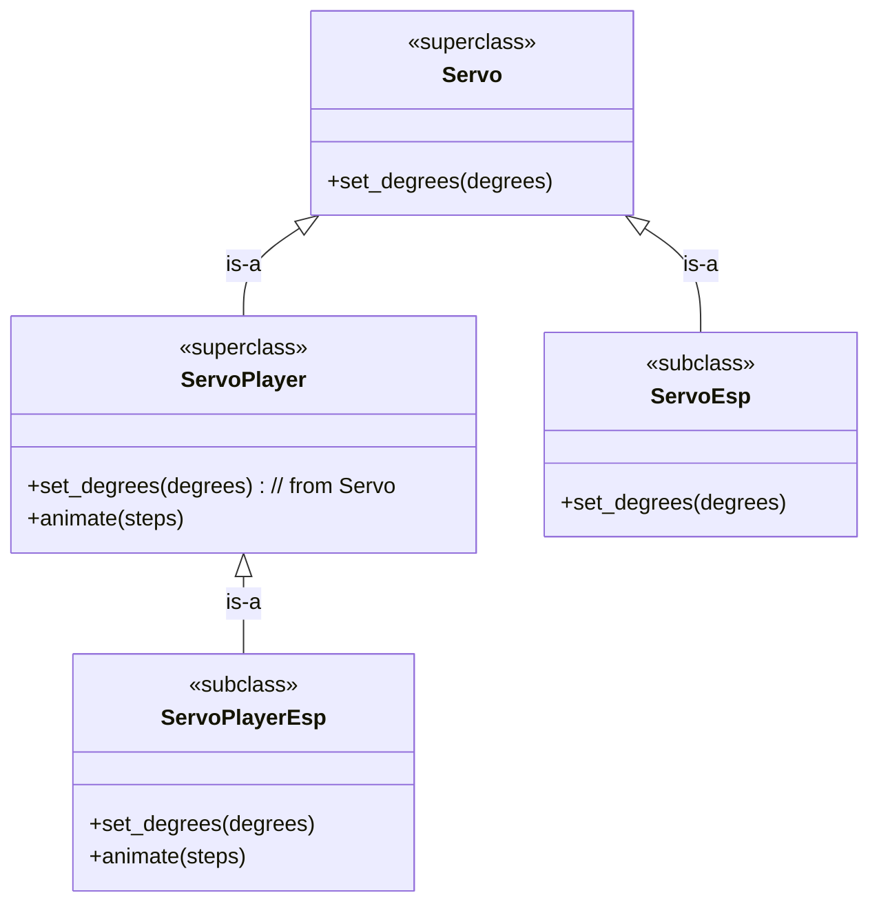

# Puzzle 2

A servo is an electric motor that can move to a specified angle. We want a `ServoEsp` (our type that controls a servo on an ESP32 microcontroller) to work with any code that needs a servo. A `ServoPlayerEsp` is similar, but with animation ability. (Inspired by `device-envoy`.)

