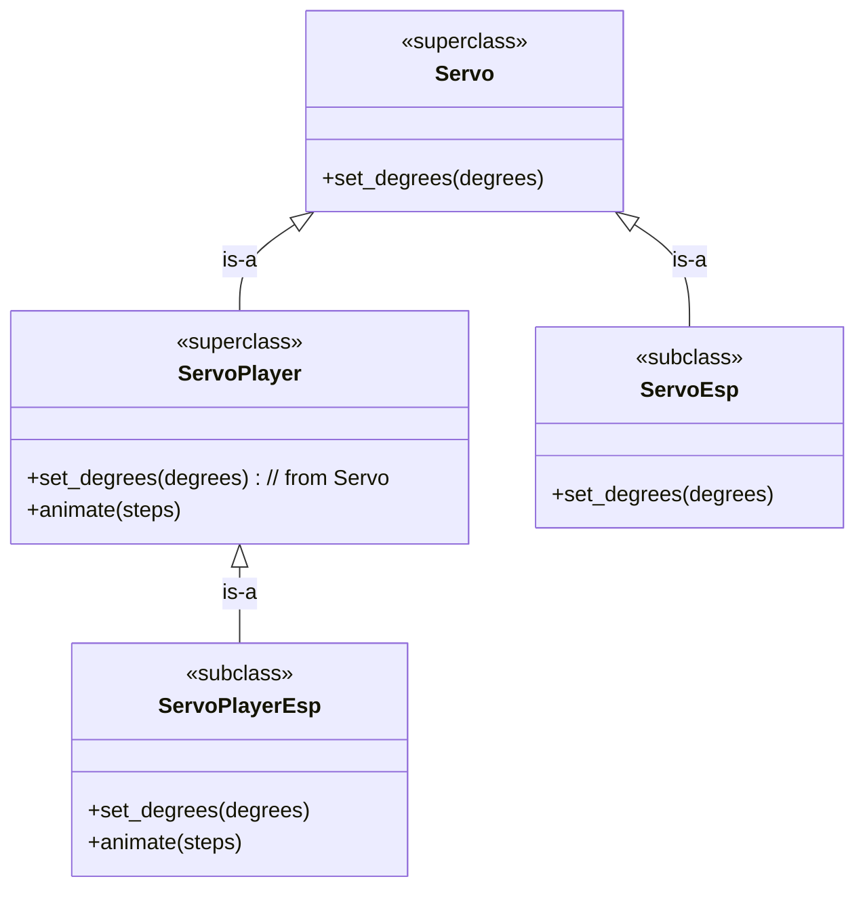

# Puzzle 2

A servo is an electric motor that can move to a specified angle.

```mermaid
classDiagram
    direction TB

    class Servo {
        <<superclass>>
        +set_degrees(degrees)
    }

    class ServoPlayer {
        <<superclass>>
        +set_degrees(degrees) // from Servo
        +animate(steps)
    }

    class ServoEsp {
        <<subclass>>
        +set_degrees(degrees)
    }

    class ServoPlayerEsp {
        <<subclass>>
        +set_degrees(degrees)
        +animate(steps)
    }

    Servo <|-- ServoPlayer : is-a
    Servo <|-- ServoEsp : is-a
    ServoPlayer <|-- ServoPlayerEsp : is-a
```
