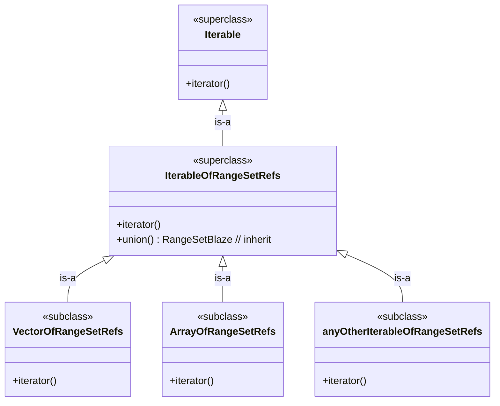

# Puzzle 3

We have `RangeSetBlaze<T>` sets and want one reusable `union` operation for a collection of set references. In OO terms, any collection that is an iterable of `RangeSetBlaze<T>` references should inherit this operation.

## Spec

1. Any `Iterable<RangeSetBlaze<T> reference>` should have `union()`.
2. `union()` returns a new `RangeSetBlaze<T>`.
3. `union()` does not consume the input sets.
4. `Vector<RangeSetBlaze<T> reference>` is-a iterable, so it has `union()`.
5. `Array<RangeSetBlaze<T> reference>` is-a iterable, so it has `union()`.

