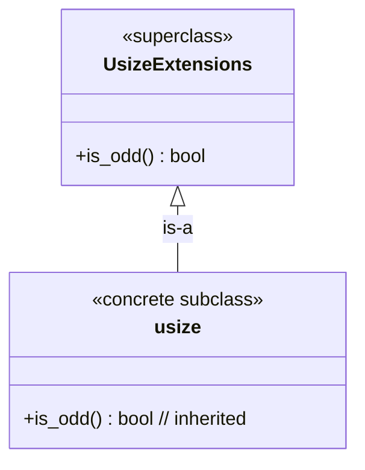

# Puzzle 7

We want to add a new method `is_odd()` to an existing concrete type `usize`, that type is defined outside our crate ("foreign").

```mermaid
classDiagram
    direction TB

    class UsizeExtensions {
        <<superclass>>
        +is_odd() bool
    }

    class usize {
        <<concrete subclass>>
        +is_odd() bool // inherited
    }

    UsizeExtensions <|-- usize : is-a
```
