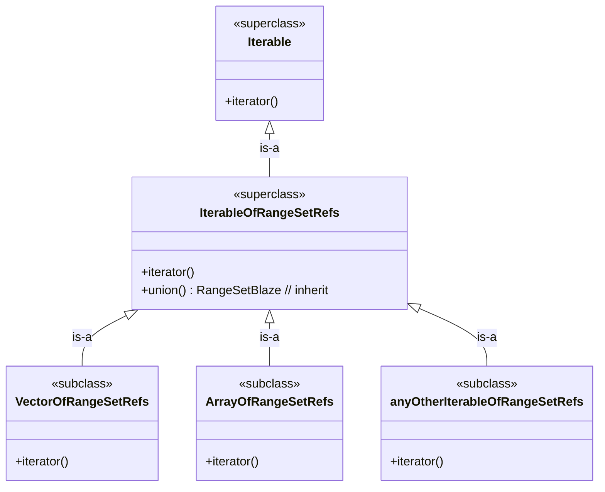

# Puzzle 3

We want to union any number of sets(`RangeSetBlaze<T>`). In OO terms, any collection that is an iterable of `RangeSetBlaze<T>` references should inherit this operation.

```mermaid
classDiagram
    direction TB

    class Iterable {
        <<superclass>>
        +iterator()
    }

    class IterableOfRangeSetRefs {
        <<superclass>>
        +iterator()
        +union() RangeSetBlaze // inherit
    }

    class VectorOfRangeSetRefs {
        <<subclass>>
        +iterator()
    }

    class ArrayOfRangeSetRefs {
        <<subclass>>
        +iterator()
    }

    class anyOtherIterableOfRangeSetRefs {
        <<subclass>>
        +iterator()
    }

    Iterable <|-- IterableOfRangeSetRefs : is-a
    IterableOfRangeSetRefs <|-- VectorOfRangeSetRefs : is-a
    IterableOfRangeSetRefs <|-- ArrayOfRangeSetRefs : is-a
    IterableOfRangeSetRefs <|-- anyOtherIterableOfRangeSetRefs : is-a
```
