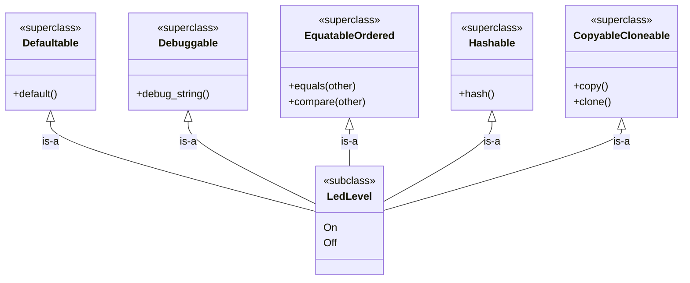

# Puzzle 4

We want a small `LedLevel` type with two values (`On`, `Off`) that automatically participates in common behaviors (default value, debugging output, equality/order comparisons, hashing, copy/clone).

## Spec

1. `LedLevel` has values `On` and `Off`.
2. Default value should be `Off`.
3. `LedLevel` should support debug-style printing.
4. `LedLevel` should support equality and ordering comparisons.
5. `LedLevel` should support hash-based collections.
6. `LedLevel` should support copy/clone semantics.

