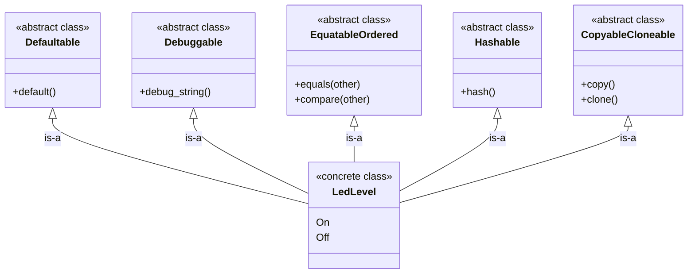

# Puzzle 4

We want a small `LedLevel` enum type with two values (`On`, `Off`) that automatically participates in common behaviors (default value, debugging output, equality/order comparisons, hashing, copy/clone).

