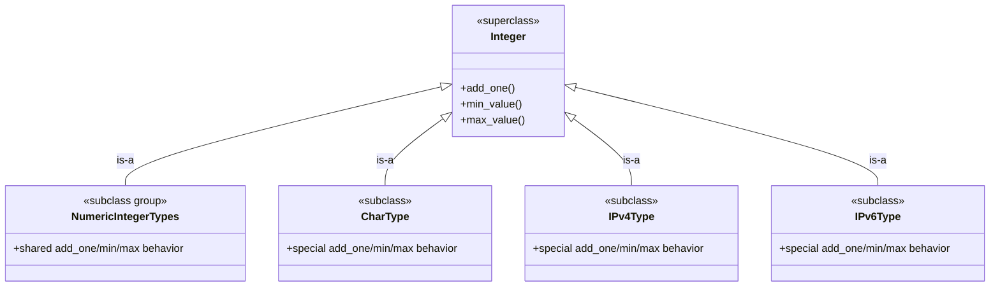

# Puzzle 5

We need one `Integer` abstraction used by many concrete types (numeric primitives, `char`, IPv4, IPv6). The contract stays the same, but we want to reuse implementation patterns so each concrete type does not hand-write the same method bodies.

## Spec

1. Every `Integer` type must provide `add_one`, `min_value`, and `max_value`.
2. Many numeric subtypes should share one common implementation pattern.
3. Some special subtypes (`char`, `IPv4`, `IPv6`) may use specialized implementations.
4. All concrete types should still be `is-a Integer`.

