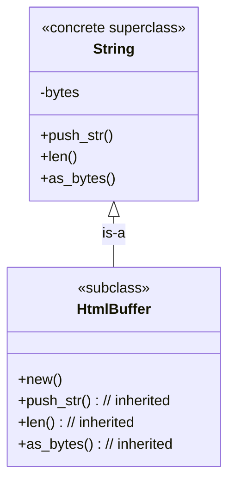

# Puzzle 6

We want an `HtmlBuffer` to feel like a string for everyday method calls, while still being its own distinct type. Note that `String` is a concrete type with storage, not just an interface/trait/abstract base class.

