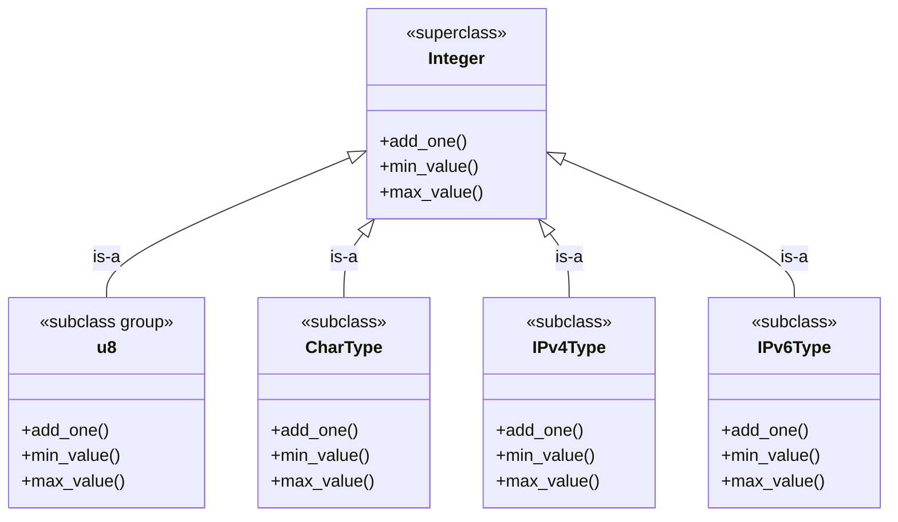

# Puzzle 5

We want to treat 15 integer-like types from `u8` to `usize` to `i128` and `char` and `IPv4`, `IPv6` uniformly. For example, with a min, max, and ability to add one (unchecked).

```mermaid
classDiagram
    direction TB

    class Integer {
        <<superclass>>
        +add_one()
        +min_value()
        +max_value()
    }

    class u8 {
        <<subclass group>>
        +add_one()
        +min_value()
        +max_value()
    }

    class CharType {
        <<subclass>>
        +add_one()
        +min_value()
        +max_value()
    }

    class IPv4Type {
        <<subclass>>
        +add_one()
        +min_value()
        +max_value()
    }

    class IPv6Type {
        <<subclass>>
        +add_one()
        +min_value()
        +max_value()
    }

    Integer <|-- u8 : is-a
    Integer <|-- CharType : is-a
    Integer <|-- IPv4Type : is-a
    Integer <|-- IPv6Type : is-a
```
