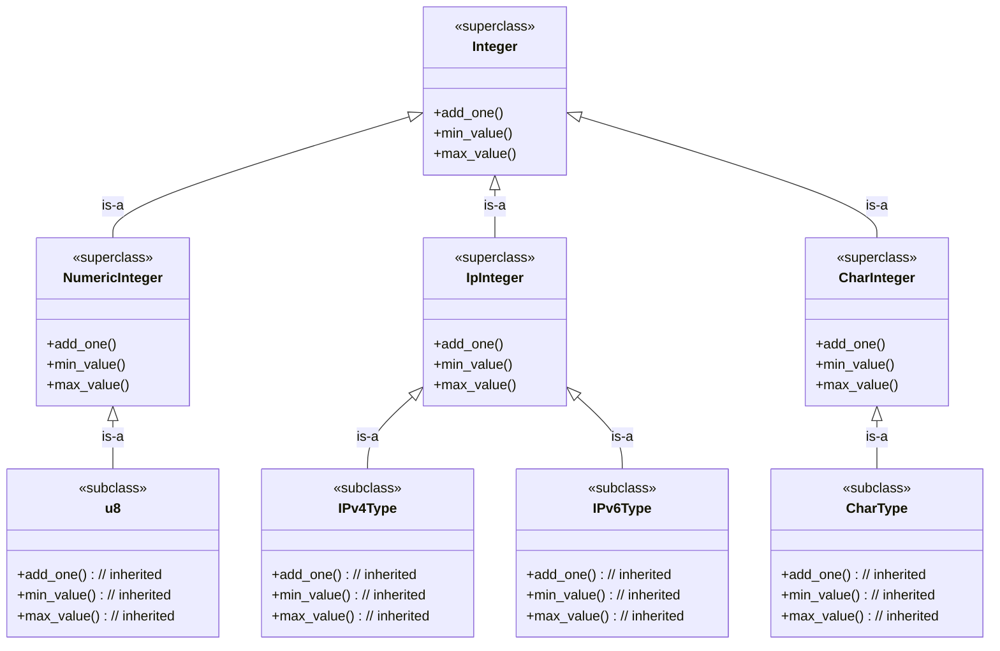

# Puzzle 5

Treat 15 integer-like types uniformly:
 `u8`, ...,  `usize`, ...`i128`, `char`, `IPv4`, `IPv6`
 
For example, with a `min`, `max`, and ability to add one (unchecked).

```mermaid
classDiagram
    direction TB

    class Integer {
        <<superclass>>
        +add_one()
        +min_value()
        +max_value()
    }

    class NumericInteger {
        <<superclass>>
        +add_one()
        +min_value()
        +max_value()
    }

    class IpInteger {
        <<superclass>>
        +add_one()
        +min_value()
        +max_value()
    }

    class CharInteger {
        <<superclass>>
        +add_one()
        +min_value()
        +max_value()
    }

    class u8 {
        <<subclass>>
        +add_one() // inherited
        +min_value() // inherited
        +max_value() // inherited
    }

    class IPv4Type {
        <<subclass>>
        +add_one() // inherited
        +min_value() // inherited
        +max_value() // inherited
    }

    class IPv6Type {
        <<subclass>>
        +add_one() // inherited
        +min_value() // inherited
        +max_value() // inherited
    }

    class CharType {
        <<subclass>>
        +add_one() // inherited
        +min_value() // inherited
        +max_value() // inherited
    }

    Integer <|-- NumericInteger : is-a
    Integer <|-- IpInteger : is-a
    Integer <|-- CharInteger : is-a

    NumericInteger <|-- u8 : is-a
    IpInteger <|-- IPv4Type : is-a
    IpInteger <|-- IPv6Type : is-a
    CharInteger <|-- CharType : is-a
```
