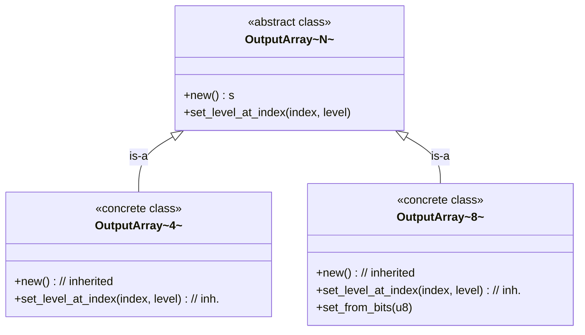

# Puzzle 8

We have abstract class `OutputArray<N>` with two methods. For `N = 8`, however, we want one extra method because it maps cleanly to a `u8` bitmask.

```mermaid
classDiagram
    direction TB

    class OutputArrayN["OutputArray~N~"] {
        <<abstract class>>
        +new()s
        +set_level_at_index(index, level)
    }

    class OutputArray4["OutputArray~4~"] {
        <<concrete class>>
        +new() // inherited
        +set_level_at_index(index, level) // inh.
    }

    class OutputArray8["OutputArray~8~"] {
        <<concrete class>>
        +new() // inherited
        +set_level_at_index(index, level) // inh.
        +set_from_bits(u8)
    }


    OutputArrayN <|-- OutputArray4 : is-a
    OutputArrayN <|-- OutputArray8 : is-a
```
