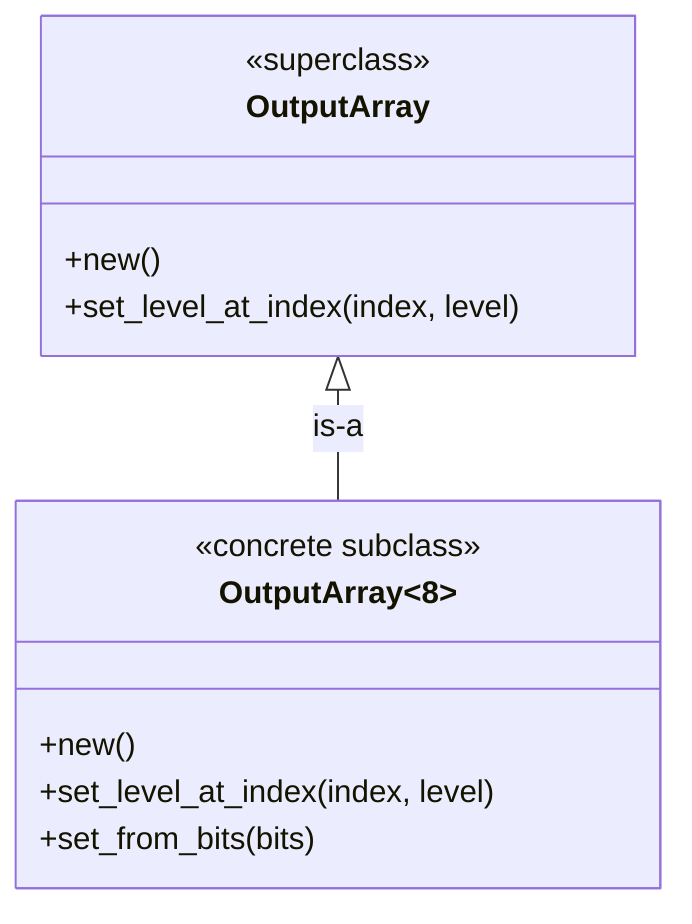

# Puzzle 8

We have an `OutputArray<N>` family where every size has the base API, but the `N = 8` variant should have one extra method because it maps cleanly to a `u8` bitmask.

```mermaid
classDiagram
    direction TB

    class OutputArrayN["OutputArray<N>"] {
        <<superclass>>
        +new()
        +set_level_at_index(index, level)
    }

    class OutputArray8["OutputArray<8>"] {
        <<concrete subclass>>
        +new()
        +set_level_at_index(index, level)
        +set_from_bits(bits)
    }

    OutputArrayN <|-- OutputArray8 : is-a
```
