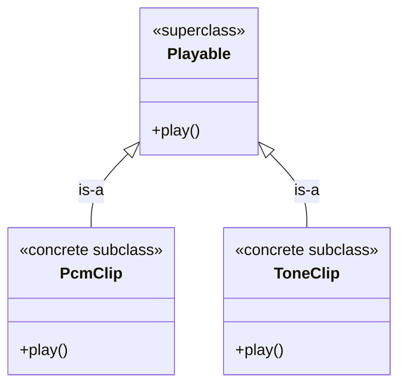

# Puzzle 9

We want one playback interface so different clip types can be treated uniformly in a single sequence at runtime.

```mermaid
classDiagram
    direction TB

    class Playable {
        <<superclass>>
        +play()
    }

    class PcmClip {
        <<concrete subclass>>
        +play()
    }

    class ToneClip {
        <<concrete subclass>>
        +play()
    }

    Playable <|-- PcmClip : is-a
    Playable <|-- ToneClip : is-a
```
