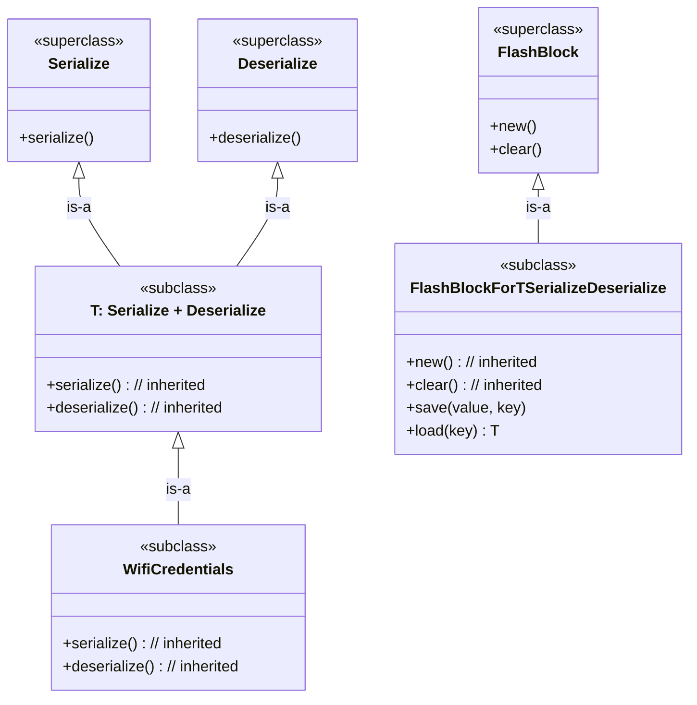

# Puzzle 9

We want two levels of `FlashBlock`: a base level with `new` and `clear`, and a constrained level that adds `save` and `load` only when `T` satisfies both serialization and deserialization capabilities.

